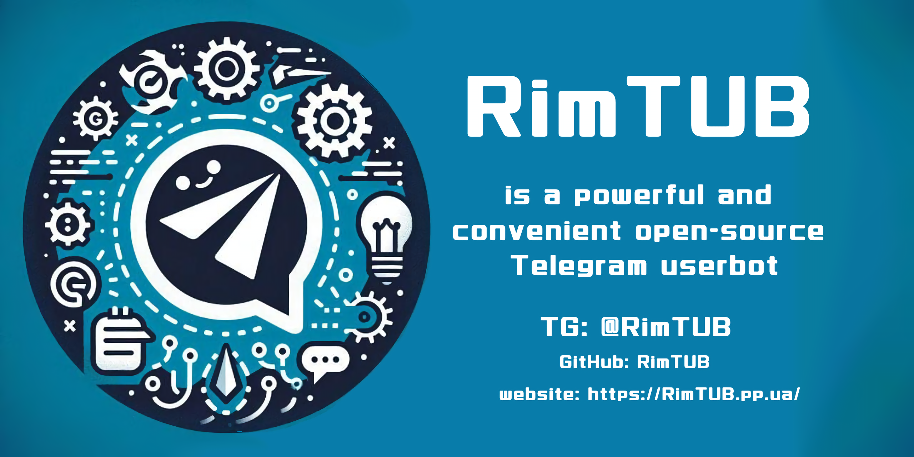

# RimTUB - RimMirK's Telegram User Bot



---

<a href="https://www.youtube.com/watch?v=nybtOIxlku8"></a>


<a href="https://RimTUB.app" target="_blank">
</a>
<a href="https://docs.RimTUB.app" target="_blank">
</a>
[](https://github.com/vshymanskyy/StandWithUkraine/blob/main/docs/README.md)

---

## English version here -> [click](README.md)

**RimTUB** — это мощный и удобный Telegram-юзербот с открытым кодом, который легко адаптировать под себя. Всё необходимое уже встроено, а для расширения возможностей достаточно установить нужные модули.  Простой в запуске, гибкий в настройке и полностью под твоим контролем — RimTUB создан, чтобы делать больше с меньшими усилиями.

> 🤖 ЮзерБоты — это скрипты, которые работают от лица твоего личного Telegram-аккаунта. Они могут делать всё, что может обычный пользователь.
>
> 😀 Например, можно сделать автоответчик, который сам будет реагировать на определённые сообщения.
>
> ✅ Обычно ЮБ используют как расширение Telegram — встроенный калькулятор, быстрый переводчик, автодобавление людей в чаты и т.д. Наверняка ты уже встречал такие штуки. Например, кто-то пишет `.calc 2+2`, и сообщение превращается в `4`.

---

## 🌟 Почему RimTUB — лучший выбор

- **Модульность** — расширяй функционал по своему желанию. Пиши свои модули или используй уже готовые.
- **Удобство** — всё интуитивно понятно: скачал, настроил конфиг, запустил.
- **Гибкость** — хочешь изменить поведение Telegram? Модули позволяют реализовать **что угодно**!
- **Мультиаккаунт** — подключай несколько Telegram-аккаунтов и управляй ими без проблем, все работает без сбоев.
- **Кроссплатформенность** — работает на Windows, Linux, macOS и даже на Android (Termux).
- **Простой запуск на хостинге** — наш партнёр [**MavisHost**](https://t.me/MavisHostNews/28) позволяет запустить RimTUB всего за пару кликов, без необходимости настраивать серверы.
- **Открытый исходный код** — и лицензия GPLv3.

## 🔗 Наш сайт: [RimTUB.app](https://rimtub.app)

Тут можно:
- Узнать больше о RimTUB
- Скачать модули
- Почитать статьи

---

## 🧠 Полезные команды "из коробки"

- `.me` — инфа о юзерботе (версия, время работы, и т.д.).
- `.help` — помощь по ЮБ.
- `.ping` — проверка пинга.
- `.restart` — перезапуск юзербота.
- `.calc <выражение>` — калькулятор.
- `.tr <язык> <текст/ответ/цитата>` — переводчик.
- `.dml <ссылка>` — установка модуля по ссылке (с сайта, например).
- `.dmf <ответ на файл>` — установка модуля с файла.

---

## ⚙ Установка

<details>
<summary><strong>Windows</strong></summary>

<a id="Windows"></a>

### 🔹 Шаг 1. Скачай RimTUB
1. Перейди по ссылке: [GitHub Releases](https://github.com/RimTUB/RimTUB/releases)  
2. Кликни по пункту где есть плашка `Latest` (это последняя версия).
3. Ниже, жми на assets (список файлов)
4. В списке файлов найди архив с названием вроде `RimTUB-XXX.zip` (XXX это версия юб) — нажми на него, чтобы скачать.  
5. Когда скачается — открой папку с файлом, нажми на архив правой кнопкой мыши и выбери **"Извлечь всё"**.  
6. Введи путь, например: `C:\RimTUB`, и нажми **"Извлечь"**.

---

### 🔹 Шаг 2. Создай Telegram-бота
1. Открой Telegram и найди пользователя [@BotFather](https://t.me/BotFather).  
2. Нажми **Start** или напиши `/start`, если бот молчит.  
3. Напиши `/newbot`, задай имя и ссылку для бота (например, `RimTUB_nickname_bot`).  
4. BotFather пришлёт тебе длинный **токен** — **скопируй его** (он выглядит так: `123456:ABC-DEF...`).  
5. ❗️ Напиши `/setinline`, выбери своего бота, и напиши любой текст, например `asdfjwekjdsf` ❗️

---

### 🔹 Шаг 3. Настрой RimTUB
1. Перейди в папку `C:\RimTUB`, которую ты только что распаковал.  
2. Найди там файл `config.yaml`.  
3. Открой его двойным щелчком. Если ничего не происходит — нажми правой кнопкой и выбери **"Открыть с помощью → Блокнот"**.  
4. Вставь туда свои данные. Пример:
   ```yaml
   PHONES:
     - +12345678990 # Твой номер, привязанный к Telegram
     - +380XXXXXXXX # Можно добавить несколько аккаунтов
   BOT_TOKEN: 123456:ABC-DEF...  # Токен, который дал BotFather
   ```
5. Сохрани файл: **Файл → Сохранить**.

---

### 🔹 Шаг 4. Установи Python
1. Перейди на сайт [python.org](https://www.python.org/).  
2. Наведи мышку на "Downloads" и выбери **Windows**.  
3. Нажми **"Download Python 3.11.9"**.
4. Когда установщик скачается — **ОБЯЗАТЕЛЬНО поставь галочку "Add Python to PATH"**, а потом нажми **"Install Now"**.  
5. Дождись окончания установки и закрой окно.

---

### 🔹 Шаг 5. Запусти RimTUB
1. Нажми клавиши **Win + R**, появится окно.  
2. Введи `cmd` и нажми **Enter** — откроется чёрное окно (командная строка).  
3. Введи по очереди следующие команды (после каждой нажимай **Enter**):

   ```sh
   cd C:\RimTUB
   python -m venv .venv
   .venv\Scripts\activate.bat
   pip install -r requirements.txt
   python main.py
   ```

   ⚠ Если появится окно с просьбой разрешить доступ в интернет — нажми **"Разрешить"**.

---

### 🔹 Шаг 6. Подтверди вход
1. После запуска бот попросит тебя ввести код.  
2. Telegram пришлёт тебе SMS — введи этот код в консоли.  
3. Если у тебя включена двухфакторная аутентификация (пароль при входе в Telegram) — введи и его.
Это нужно будет сделать только один раз

---

🎉 Готово! RimTUB запущен! Ура-ура

</details>

<details>

<summary><strong>Docker</strong></summary>

<a id="Docker"></a>

### 🔹 Шаг 1. Клонирование репозитория RimTUB

1. Введите в терминале команду:

   ```sh
   git clone https://github.com/RimTUB/RimTUB
   ```

---

### 🔹 Шаг 2. Создание Telegram-бота

1. Откройте Telegram и найдите пользователя [@BotFather](https://t.me/BotFather).
2. Нажмите **Start** или введите `/start`, если бот не отвечает.
3. Введите `/newbot`, укажите имя и ссылку для бота (например, `RimTUB_nickname_bot`).
4. BotFather пришлёт длинный **токен** — **скопируйте его** (пример: `123456:ABC-DEF...`).
5. ❗️ Введите `/setinline`, выберите своего бота и введите любой текст, например `asdfjwekjdsf`. ❗️

---

### 🔹 Шаг 3. Настройка RimTUB

1. В терминале перейдите в папку, куда вы только что клонировали RimTUB:

   ```sh
   cd RimTUB
   ```
2. Откройте файл конфигурации `config.yaml` в любом текстовом редакторе, например, `nano`:

   ```sh
   nano config.yaml
   ```
3. Вставьте туда свои данные. Пример:

   ```yaml
   PHONES:
     - +12345678990 # Ваш номер телефона, привязанный к Telegram
     - +380XXXXXXXX # Можно добавить несколько аккаунтов

   BOT_TOKEN: 123456:ABC-DEF...  # Токен, выданный BotFather
   ```
4. Чтобы сохранить файл в `nano`, нажмите **Ctrl + S**. Для выхода — **Ctrl + X**.

---

### 🔹 Шаг 4. Запуск

1. Соберите образ RimTUB:

   ```sh
   docker build -t rimtub .
   ```

---

2. Запустите RimTUB в интерактивном режиме:

   ```sh
   docker-compose up
   ```

---

### 🔹 Шаг 5. Подтверждение входа

1. После запуска бот попросит ввести код.
2. Telegram пришлёт вам SMS — введите этот код в консоль.
3. Если включена двухфакторная аутентификация (пароль при входе в Telegram) — введите и его. Это нужно сделать только один раз.
4. Для выхода нажмите дважды **Ctrl + C**.

---

### 🔹 Шаг 6. Запуск в фоне

1. Запустите RimTUB в фоновом режиме:

   ```sh
   docker-compose up -d
   ```

---

🎉 Готово! RimTUB работает в Docker!


</details>


<details>
<summary><strong>Linux</strong></summary>

<a id="Linux"></a>

### 🔹 Шаг 1. Установи необходимые зависимости
1. Открой терминал.
2. Введи следующую команду для обновления пакетов и установки зависимостей:
   ```sh
   sudo apt update
   sudo apt install git python3.11 python3.11-venv -y
   ```

---

### 🔹 Шаг 2. Клонируй репозиторий RimTUB
1. В терминале введи команду:
   ```sh
   git clone https://github.com/RimTUB/RimTUB
   ```

---

### 🔹 Шаг 3. Создай Telegram-бота
1. Открой Telegram и найди пользователя [@BotFather](https://t.me/BotFather).  
2. Нажми **Start** или напиши `/start`, если бот молчит.  
3. Напиши `/newbot`, задай имя и ссылку для бота (например, `RimTUB_nickname_bot`).  
4. BotFather пришлёт тебе длинный **токен** — **скопируй его** (он выглядит так: `123456:ABC-DEF...`).  
5. ❗️ Напиши `/setinline`, выбери своего бота, и напиши любой текст, например `asdfjwekjdsf`. ❗️

---

### 🔹 Шаг 4. Настрой RimTUB
1. В терминале перейди в папку, куда ты только что клонировал RimTUB:
   ```sh
   cd RimTUB
   ```
2. Открой файл конфигурации `config.yaml` с помощью текстового редактора, например, `nano`:
   ```sh
   nano config.yaml
   ```
3. Вставь туда свои данные. Пример:
   ```yaml
   PHONES:
     - +12345678990 # Твой номер, привязанный к Telegram
     - +380XXXXXXXX # Можно добавить несколько аккаунтов
   
   BOT_TOKEN: 123456:ABC-DEF...  # Токен, который дал BotFather
   ```
4. Чтобы сохранить файл в `nano`, нажми **Ctrl + S** чтобы сохранить. После этого выйди, нажав **Ctrl + X**.

---

### 🔹 Шаг 5. Создай и активируй виртуальное окружение
1. Введи команду для создания виртуального окружения:
   ```sh
   python3.11 -m venv .venv
   ```
2. Активируй виртуальное окружение:
   ```sh
   source .venv/bin/activate
   ```

---

### 🔹 Шаг 6. Установи зависимости и запусти RimTUB
1. Установи все необходимые библиотеки:
   ```sh
   pip install -r requirements.txt
   ```
2. Запусти RimTUB:
   ```sh
   python main.py
   ```

---

### 🔹 Шаг 7. Подтверди вход
1. После запуска бот попросит тебя ввести код.
2. Telegram пришлёт тебе SMS — введи этот код в консоли.
3. Если у тебя включена двухфакторная аутентификация (пароль при входе в Telegram) — введи и его. Это нужно будет сделать только один раз.

---

🎉 Готово! RimTUB работает на твоём Linux'е! Ура-ура!

</details>

<details>
<summary><strong>macOS</strong></summary>

<a id="macOS"></a>

### 🔹 Шаг 1. Установи необходимые зависимости
1. Открой **Terminal** (Терминал).
2. Введи команду для установки `Homebrew` (если он не установлен):
   ```sh
   /bin/bash -c "$(curl -fsSL https://raw.githubusercontent.com/Homebrew/install/HEAD/install.sh)"
   ```
   Следуй инструкциям в терминале для завершения установки.
   
3. Установи Python 3.11 и Git через Homebrew:
   ```sh
   brew install git python@3.11
   ```

---

### 🔹 Шаг 2. Клонируй репозиторий RimTUB
1. Введи команду для клонирования репозитория:
   ```sh
   git clone https://github.com/RimTUB/RimTUB
   ```

---

### 🔹 Шаг 3. Создай Telegram-бота
1. Открой Telegram и найди пользователя [@BotFather](https://t.me/BotFather).  
2. Нажми **Start** или напиши `/start`, если бот молчит.  
3. Напиши `/newbot`, задай имя и ссылку для бота (например, `RimTUB_nickname_bot`).  
4. BotFather пришлёт тебе длинный **токен** — **скопируй его** (он выглядит так: `123456:ABC-DEF...`).  
5. ❗️ Напиши `/setinline`, выбери своего бота, и напиши любой текст, например `asdfjwekjdsf`. ❗️

---

### 🔹 Шаг 4. Настрой RimTUB
1. В терминале перейди в папку с проектом:
   ```sh
   cd RimTUB
   ```
2. Открой файл конфигурации `config.yaml` с помощью текстового редактора, например, `nano`:
   ```sh
   nano config.yaml
   ```
3. Вставь свои данные. Пример:
   ```yaml
   PHONES:
     - +12345678990 # Твой номер, привязанный к Telegram
     - +380XXXXXXXX # Можно добавить несколько аккаунтов
   BOT_TOKEN: 123456:ABC-DEF...  # Токен, который дал BotFather
   ```
4. Чтобы сохранить файл в `nano`, нажми **Ctrl + O**, затем **Enter** для подтверждения. После этого выйди, нажав **Ctrl + X**.

---

### 🔹 Шаг 5. Создай и активируй виртуальное окружение
1. Введи команду для создания виртуального окружения:
   ```sh
   python3.11 -m venv .venv
   ```
2. Активируй виртуальное окружение:
   ```sh
   source .venv/bin/activate
   ```

---

### 🔹 Шаг 6. Установи зависимости и запусти RimTUB
1. Установи все необходимые библиотеки:
   ```sh
   pip install -r requirements.txt
   ```
2. Запусти RimTUB:
   ```sh
   python main.py
   ```

---

### 🔹 Шаг 7. Подтверди вход
1. После запуска бот попросит тебя ввести код.
2. Telegram пришлёт тебе SMS — введи этот код в консоли.
3. Если у тебя включена двухфакторная аутентификация (пароль при входе в Telegram) — введи и его. Это нужно будет сделать только один раз.

---

🎉 Готово! RimTUB работает на твоём маке! Ура-ура!

</details>

<details>
<summary><strong>Termux (Android)</strong></summary>

<a id="Termux"></a>

### 🔹 Шаг 1. Установи Termux
1. Перейди в [F-Droid](https://f-droid.org/packages/com.termux/) и скачай **Termux**.
2. Установи его на своём устройстве.

---

### 🔹 Шаг 2. Клонируй репозиторий RimTUB
1. Открой **Termux**.
2. Клонируй репозиторий RimTUB:
   ```sh
   apt update && apt upgrade -y && apt install git -y
   git clone https://github.com/RimTUB/RimTUB
   ```

---

### 🔹 Шаг 3. Создай Telegram-бота
1. Открой Telegram и найди пользователя [@BotFather](https://t.me/BotFather).  
2. Нажми **Start** или напиши `/start`, если бот молчит.  
3. Напиши `/newbot`, задай имя и ссылку для бота (например, `RimTUB_nickname_bot`).  
4. BotFather пришлёт тебе длинный **токен** — **скопируй его** (он выглядит так: `123456:ABC-DEF...`).  
5. ❗️ Напиши `/setinline`, выбери своего бота, и напиши любой текст, например `asdfjwekjdsf`. ❗️

---

### 🔹 Шаг 4. Настрой RimTUB
1. В **Termux** перейди в папку с проектом:
   ```sh
   cd RimTUB
   ```
2. Открой файл конфигурации `config.yaml` с помощью текстового редактора, например, `nano`:
   ```sh
   nano config.yaml
   ```
3. Вставь свои данные. Пример:
   ```yaml
   PHONES:
     - +12345678990 # Твой номер, привязанный к Telegram
     - +380XXXXXXXX # Можно добавить несколько аккаунтов
   BOT_TOKEN: 123456:ABC-DEF...  # Токен, который дал BotFather
   ```
4. Чтобы сохранить файл в `nano`, нажми **Ctrl + O**, затем **Enter** для подтверждения. После этого выйди, нажав **Ctrl + X**.

---

### 🔹 Шаг 5. Запуск Termux.sh для установки зависимостей
1. В **Termux** введи команду для выполнения скрипта `termux.sh`, который установит все необходимые зависимости:
   ```sh
   bash termux.sh
   ```
2. Дождись завершения установки зависимостей.

---

### 🔹 Шаг 6. Запусти RimTUB
1. После того как все зависимости установлены, запусти RimTUB:
   ```sh
   python main.py
   ```

---

### 🔹 Шаг 7. Подтверди вход
1. После запуска бот попросит тебя ввести код.
2. Telegram пришлёт тебе SMS — введи этот код в консоли.
3. Если у тебя включена двухфакторная аутентификация (пароль при входе в Telegram) — введи и его. Это нужно будет сделать только один раз.

---

🎉 Готово! RimTUB работает на твоём телефоне! Ура-ура!

</details>

<details>
<summary><strong>UserLAnd (Android)</strong></summary>

<a id="UserLAnd"></a>

### 🔹 Шаг 1. Установка UserLAnd
1. Перейди в [Play Market](https://play.google.com/store/apps/details?id=tech.ula) и скачай **UserLAnd**.
2. Установи его на своё устройство.

---

### 🔹 Шаг 2. Установка Python и RimTUB
1. Открой **UserLAnd**.
2. Выбери **Debian (только терминал)**.
3. В терминале выполни следующие команды (займёт до 40 минут):
```bash
sudo apt update && sudo apt upgrade -y

sudo apt install -y wget build-essential libssl-dev zlib1g-dev \
libncurses5-dev libncursesw5-dev libreadline-dev libsqlite3-dev \
libgdbm-dev libdb5.3-dev libbz2-dev libexpat1-dev liblzma-dev \
tk-dev uuid-dev libffi-dev

cd /tmp
wget https://www.python.org/ftp/python/3.11.9/Python-3.11.9.tgz
tar -xvf Python-3.11.9.tgz
cd Python-3.11.9

./configure --enable-optimizations
make -j$(nproc)
sudo make altinstall

sudo ln -sf /usr/local/bin/python3.11 /usr/bin/python
sudo ln -sf /usr/local/bin/python3.11 /usr/bin/python3
sudo ln -sf /usr/local/bin/python3.11 /usr/bin/py
sudo ln -sf /usr/local/bin/python3.11 /usr/bin/py3

py -m ensurepip

sudo ln -sf /usr/local/bin/pip3.11 /usr/bin/pip
sudo ln -sf /usr/local/bin/pip3.11 /usr/bin/pip3

cd ..
cd ..

sudo apt install -y git
sudo apt install -y nano

git clone https://github.com/RimTUB/RimTUB

cd RimTUB

py -m venv .venv

source .venv/bin/activate

sudo pip install -r requirements.txt
```

---

### 🔹 Шаг 3. Создание Telegram-бота
1. Открой Telegram и найди пользователя [@BotFather](https://t.me/BotFather).  
2. Нажми **Start** или введи `/start`, если он молчит.  
3. Введи `/newbot`, задай имя и ссылку для бота (например, `RimTUB_nickname_bot`).  
4. BotFather пришлёт длинный **токен** — **скопируй его** (он выглядит как `123456:ABC-DEF...`).  
5. ❗️ Введи `/setinline`, выбери своего бота и напиши любой текст, например `asdfjwekjdsf`. ❗️

---

### 🔹 Шаг 4. Настройка RimTUB
1. Открой файл конфигурации `config.yaml` через текстовый редактор, например `nano`:
   ```sh
   nano config.yaml
   ```
2. Вставь свои данные. Пример:
   ```yaml
   PHONES:
     - +12345678990 # Твой номер телефона, привязанный к Telegram
     - +380XXXXXXXX # Можно добавить несколько аккаунтов
   BOT_TOKEN: 123456:ABC-DEF...  # Токен, выданный BotFather
   ```
3. Чтобы сохранить файл в `nano`, нажми **Ctrl + S**. Затем выйди с помощью **Ctrl + X**.

---

### 🔹 Шаг 5. Запуск RimTUB
1. После установки всех зависимостей запусти RimTUB:
   ```sh
   python main.py
   ```

---

### 🔹 Шаг 6. Подтверждение входа
1. После запуска бот попросит ввести код.
2. Telegram пришлёт тебе СМС — введи этот код в консоли.
3. Если у тебя включена двухфакторная аутентификация (пароль при входе в Telegram) — введи и его. Делать это нужно только один раз.

---

🎉 Готово! RimTUB работает на твоём телефоне! Ура!

</details>

---

## 📚 Документация по модулям: **[docs.rimtub.app](https://docs.rimtub.app)**

Здесь ты найдёшь всё, чтобы написать свой модуль для RimTUB:

- **Пошаговые инструкции** по написанию и структуре модулей.
- **Полное описание доступных функций** и методов для работы с RimTUB.
- **Примеры кода**, которые помогут быстро начать разработку.

Если ты хочешь создавать свои крутые модули, то обязательно изучи документацию. В ней есть всё! А если не поймешь что-то, то можешь обратится за помощью к разрабочику (контакты ниже)

---

## ❓ FAQ

- **Можно ли на телефон?**  
  > Да! Просто ставь через Termux.

- **Если не могу запустить на своём устройстве?**  
  > Пиши [@RimMirK](https://t.me/RimMirK), он может помочь с хостингом.

- **Можно заказать модуль?**  
  > Да, тоже пиши [@RimMirK](https://t.me/RimMirK)

- **Хочу добавить модуль на сайт**  
  > Без проблем, напиши [@RimMirK](https://t.me/RimMirK)


---

## 💬 Контакты и Ссылки

- **Разработчик**: [@RimMirK](https://t.me/RimMirK) 
- **Телеграм Канал**: [@RimTUB](https://t.me/RimTUB)
- **Телеграм Чат**: [@RimTUB_chat](https://t.me/RimTUB_chat)
- **Официальный сайт**: [rimtub.app](https://rimtub.app/)
- **Документация**: [docs.rimtub.app](https://docs.rimtub.app/)
- **Партнер MavisHost**: [@MavisHostNews](https://t.me/MavisHostNews/28)

---
